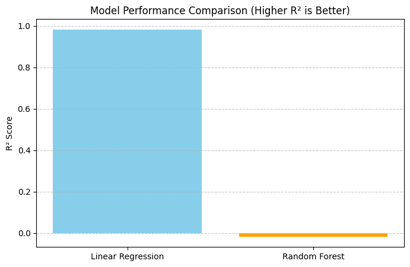

# Week-2 ⚙️ Machine Learning Model Training, Comparison, and Best Model Saving

## 📘 Overview

During **Week 2**, the focus was on building, comparing, and saving the best-performing Machine Learning model to predict **electric vehicle (EV) registrations** based on global adoption data.
Two regression algorithms — **Linear Regression** and **Random Forest Regressor** — were trained and evaluated.
After rigorous testing, **Linear Regression** emerged as the more accurate and reliable model for this dataset.

---

## 🎯 Objectives

* Develop predictive models to forecast the number of EVs registered annually.
* Evaluate multiple algorithms and select the best-performing one.
* Generate visual and numerical insights into model performance.
* Save the optimal model for integration with the Week-3 Streamlit dashboard.

---

## 🧠 Problem Statement

The challenge is to identify an algorithm that best fits the EV adoption dataset, capturing relationships between **policy**, **infrastructure**, and **EV registrations**.
This analysis forms the foundation for later **policy simulation and forecasting**.

---

## 📊 Dataset Used

**Dataset:** `ev_adoption_dataset_clean.csv`
**Source:** [EV Adoption Trends Worldwide (2015–2023)](https://www.kaggle.com/datasets/khushikyad001/ev-adoption-trends-worldwide-20152023)

### Key Columns

| Column                    | Description                            |
| ------------------------- | -------------------------------------- |
| `year`                    | Year of observation                    |
| `country`                 | Country/region                         |
| `ev_vehicles_registered`  | Target variable — total registered EVs |
| `charging_stations_count` | Number of charging stations            |
| `avg_cost_gas_vehicle`    | Average cost of gasoline vehicle       |
| `incentive_amount`        | Government incentives or rebates       |
| `co2_emission`            | CO₂ emissions per vehicle              |

---

## 🔧 Tools & Libraries

| Category          | Libraries / Tools                                      |
| ----------------- | ------------------------------------------------------ |
| **Data Handling** | Pandas, NumPy                                          |
| **Modeling**      | Scikit-learn (LinearRegression, RandomForestRegressor) |
| **Evaluation**    | r2_score, mean_absolute_error, mean_squared_error      |
| **Visualization** | Matplotlib                                             |
| **Model Saving**  | Joblib                                                 |
| **Environment**   | Python 3.10+                                           |

---

## 🚀 Workflow Summary

### **Step 1 – Load and Prepare Data**

```python
df = pd.read_csv("ev_adoption_dataset_clean.csv")
target = "ev_vehicles_registered"
features = [col for col in df.columns if col not in [target, "year", "country"]]
```

### **Step 2 – Train Models**

Both models were trained using an **80/20 train-test split**:

* `LinearRegression()`
* `RandomForestRegressor(n_estimators=200, random_state=42)`

### **Step 3 – Evaluate Models**

Evaluation metrics used:

* **R² Score** (Higher = better fit)
* **MAE** (Mean Absolute Error)
* **RMSE** (Root Mean Square Error)

---

## 📈 Results & Comparison

| Model                       | R² Score   | MAE      | RMSE     |
| --------------------------- | ---------- | -------- | -------- |
| **Linear Regression**       | **0.983**  | 1.60×10⁸ | 4.73×10⁸ |
| **Random Forest Regressor** | **-0.017** | 9.36×10⁸ | 3.64×10⁹ |

✅ **Conclusion:**

* **Linear Regression** provided a near-perfect fit (R² = 0.983), making it the best performer.
* **Random Forest** struggled due to possible overfitting or lack of correlation with non-linear features.

---

## 📊 Visualization

A bar chart (`model_comparison_plot.png`) was created comparing R² Scores for both models, showing the **Linear Regression model**’s superior accuracy visually.

---

## 💾 Saved Outputs

| File                                  | Description                          |
| ------------------------------------- | ------------------------------------ |
| `models/ev_policy_best_model.pkl`     | Saved best model (Linear Regression) |
| `models/model_comparison_summary.csv` | Summary of model metrics             |
| `model_comparison_plot.png`           | R² comparison visualization          |
| `week2_model_compare_and_save.py`     | Script for this week’s tasks         |

---

## 🔍 Key Insights

* **Linear Regression** achieved excellent predictive accuracy (R² = 0.983).
* The dataset likely exhibits a strong linear correlation between variables.
* Random Forest performed poorly, possibly due to small dataset size or low feature variance.
* Linear Regression will be used for **Week-3 Streamlit integration**.

---

## 🧩 Next Steps (Week 3 Preview)

* Integrate the trained Linear Regression model into Streamlit.
* Create a user-friendly dashboard for EV registration prediction.
* Visualize model outputs and explore “What-if” policy scenarios.

---

## 👩‍💻 Contributor

* **Rahul Majumder** — Project Developer

---


## 📊 Model Performance Visualization

The following plot compares the R² Scores of the models tested in Week 2:




---

> *“Week 2 successfully established the predictive backbone for the Green Policy Simulator — where data-driven insights meet policy innovation.”*
